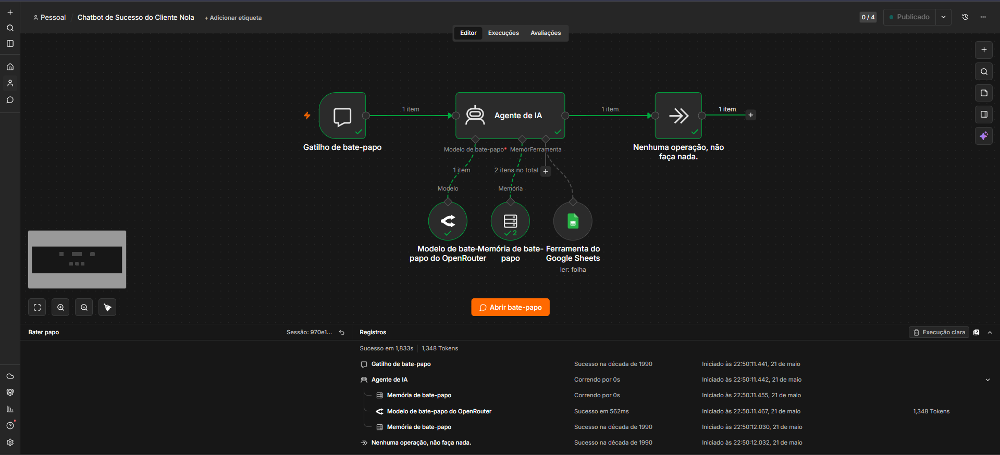

# chatbot-n8n
Projeto de automação criado no n8n com foco em chatbot e fluxos inteligentes. Utiliza integrações e automações para otimizar processos, respostas automáticas e organização de tarefas.

## Fluxo da Automação

O fluxo utiliza um gatilho de chat conectado a um agente de IA com memória conversacional e integração em tempo real com Google Sheets para consulta da base de conhecimento.

###Chatbot Inteligente para Customer Success | Desafio Técnico

Sobre o Projeto
Projeto desenvolvido como solução para um desafio técnico com foco em automação de atendimento e Customer Success utilizando IA e N8N.

A proposta foi criar um chatbot inteligente capaz de responder dúvidas frequentes de clientes de uma plataforma de gestão para restaurantes, utilizando uma base de conhecimento estruturada e respostas contextualizadas em tempo real.

#####Objetivo: 

Desenvolver uma solução escalável de atendimento automatizado capaz de:

reduzir chamados repetitivos
padronizar respostas
otimizar o tempo do time de Customer Success
melhorar a experiência do cliente
Como a Solução Funciona

O fluxo foi desenvolvido no N8N integrando:

Chat Trigger
Agente de IA
Memória Conversacional
Google Sheets como base de conhecimento

O chatbot consulta uma base estruturada de FAQs e responde de forma humanizada, contextualizada e alinhada ao tom de voz da empresa.

######Processo de Construção

Para construir a solução:

Foram identificadas as principais dores dos clientes da plataforma.
Utilizei o Claude (Anthropic) para estruturar a base de conhecimento e auxiliar na criação dos prompts.
A base foi organizada no Google Sheets com perguntas divididas em categorias estratégicas.
O fluxo foi orquestrado no N8N utilizando IA, memória e integração em tempo real.
Tecnologias Utilizadas
N8N
GPT-4o-mini
OpenRouter
Claude (Anthropic)
Google Sheets
Diferenciais do Projeto
Atendimento automatizado 24/7
Respostas padronizadas
Fácil manutenção da base de conhecimento
Fluxo escalável
Memória conversacional
Estrutura pronta para expansão
Resultado Esperado

Permitir que equipes de Customer Success foquem em atendimentos estratégicos enquanto a IA resolve dúvidas recorrentes de forma rápida e eficiente.
